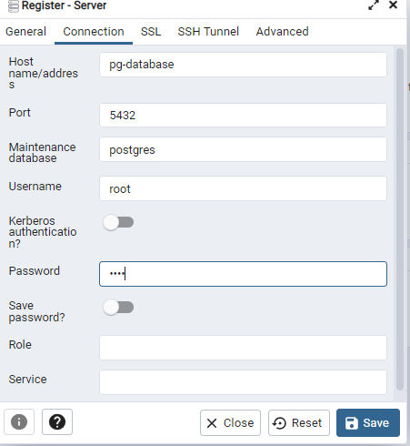

# Set up

## Introduction to Docker
[More info here](https://www.youtube.com/watch?v=EYNwNlOrpr0&list=PL3MmuxUbc_hJed7dXYoJw8DoCuVHhGEQb&index=4)
## Why should we care about docker?
Docker is a tool designed to make it easier to create, deploy, and run applications by using containers. Containers allow a developer to package up an application with all of the parts it needs, such as libraries and other dependencies, and ship it all out as one package. By doing so, thanks to the container, the developer can rest assured that the application will run on any other Linux machine regardless of any customized settings that machine might have that could differ from the machine used for writing and testing the code.

## First command using docker
Run a image called `hello-world`
```
docker run hello-world
```
## Python Image
Run a image called `python`
```
docker run -it python:3.9
```
where:
- `-it` is for interactive mode

### Installing pandas on it
First we have to access to the container, not in python.
```
docker run -it --entrypoint=bash python:3.9
```
where:
- `--entrypoint=bash` is for access to the container

Then we can install pandas
```
pip install pandas
```
The problem is that when we try to access to the container again, we woudn't be able to call pandas, we'll have to install it another time.

## Dockerfile
A Dockerfile is a text document that contains all the commands a user could call on the command line to assemble an image. Using docker build users can create an automated build that executes several command-line instructions in succession.

### Dockerfile example
```
FROM python:3.9

RUN pip install pandas

ENTRYPOINT ["bash"]
```
where:
- `FROM` is for the base image
- `RUN` is for the command to run

## Build the image
```
docker build -t test:pandas .
```
where:
- `-t` is for the tag
- `.` means this directory.

## Run the image
```
docker run -it test:pandas
```

## Testing our docker container with a python script
I'll create a python script called `pipeline.py` with the following content:
```
import pandas as pd

df = pd.DataFrame({'a': [1, 2, 3], 'b': [4, 5, 6]})

print(df)

```
Then I'll add these lines to the docker container:
```
WORKDIR /app
COPY pipeline.py pipeline.py
ENTRYPOINT ["python", "pipeline.py"]
```
where:
- `WORKDIR` is for the directory
- `COPY` is for copy the file

## Build the docker image again
```
docker build -t test:pandas .
```
## Run it
```
docker run -it test:pandas
```

## Ingesting NY Taxi Data to Postgres
[More info here](https://www.youtube.com/watch?v=2JM-ziJt0WI&list=PL3MmuxUbc_hJed7dXYoJw8DoCuVHhGEQb)

### First at all, we need a docker-compose file in order to run Postgres.
```
services:
  pgdatabase:
    image: postgres:13
    environment:
      - POSTGRES_USER=root
      - POSTGRES_PASSWORD=root
      - POSTGRES_DB=ny_taxi
    volumes:
      - "./ny_taxi_postgres_data:/var/lib/postgresql/data:rw"
    ports:
      - "5432:5432"
  pgadmin:
    image: dpage/pgadmin4
    environment:
      - PGADMIN_DEFAULT_EMAIL=admin@admin.com
      - PGADMIN_DEFAULT_PASSWORD=root
    ports:
      - "8080:80"
```
We have created a folder called `ny_taxi_postgres_data`, we'll map this folder with this other one `/var/lib/postgresql/data:rw` in the dockerfile.

### Run it
```sh
docker-compose up
```
If we had used dockerfile, it would have been like this:
```docker
docker run -it `
-e POSTGRES_USER="root" `
-e POSTGRES_PASSWORD="root" `
-e POSTGRES_DB="ny_taxi" `
-v C:\Users\User\Desktop\Github\data-engineering-camp\week_1_basics_n_setup\ny_taxi_postgres_data:/var/lib/postgresql/data `
-p 5432:5432 ` postgres:13
```
where:
- `-e` is for the environment variables
- `-v` is for volume
- `-p` is for port

### Connect to the database
We can use `pgcli` to connect to our database.
```sh
pgcli -h localhost -p 5432 -U root -d ny_taxi
```
Don't forget to install pgcli before, use:
```sh
pip install pgcli
```
The first time you might type the password: root.

## Create a jupyter notebook in order to work on it.
### Enviroment
I'll create a virtual enviroment for this camp using anaconda
```sh
conda create -n data_engineering_camp python=3.9
```
Then I'll activate it
```sh
conda activate data_engineering_camp
```
### Install the libraries
```sh
pip install -r requirements.txt
```
### Download NYC Trip data from [here](https://www.nyc.gov/site/tlc/about/tlc-trip-record-data.page)
We have got a parquet file, because of this we need a way to read it in pandas.
```sh
pip install pyarrow
```
And read it using:
```python
import pandas as pd

df = pd.read_parquet("yellow_tripdata_2020-01.parquet", engine="pyarrow")
```

### Working on this [file](notebook.ipynb)

After insert the data to the DB, we can use this command to see how many data do we have:
```sql
SELECT COUNT(*) FROM yellow_taxi_data;
```

## Connecting pgAdmin and Postgres
Watch more [here](https://www.youtube.com/watch?v=hCAIVe9N0ow&list=PL3MmuxUbc_hJed7dXYoJw8DoCuVHhGEQb)

Using docker to run pgadmin in docker:
```docker
docker run -it `
-e PGADMIN_DEFAULT_EMAIL="admin@admin.com" `
-e PGADMIN_DEFAULT_PASSWORD="root" `
-p 8080:80 `
dpage/pgadmin4
```

Open the browser and access it.
```
http://localhost:8080
```
## Connect these containers using networks
### Create a network
```sh
docker network create pg-network
```
### Run the containers
```docker
docker run -it `
-e POSTGRES_USER="root" `
-e POSTGRES_PASSWORD="root" `
-e POSTGRES_DB="ny_taxi" `
-v C:\Users\User\Desktop\Github\data-engineering-camp\week_1_basics_n_setup\ny_taxi_postgres_data:/var/lib/postgresql/data `
-p 5432:5432 --network=pg-network `
--name=pg-database ` postgres:13
```

```docker
docker run -it `
-e PGADMIN_DEFAULT_EMAIL="admin@admin.com" `
-e PGADMIN_DEFAULT_PASSWORD="root" `
-p 8080:80 `
--network=pg-network `
--name=pgadmin-2 `
dpage/pgadmin4
```

## Connect pgAdmin to Postgres
- Open pgAdmin
- Create a new server
- Follow this image

## Dockerizing the ingestion script
Watch more [here](https://www.youtube.com/watch?v=B1WwATwf-vY&list=PL3MmuxUbc_hJed7dXYoJw8DoCuVHhGEQb&index=8)

### Convert jupyter notebook into a python script
```sh
jupyter nbconvert --to script notebook.ipynb
```
Before testing the script, delete the table:
```sql
DROP TABLE yellow_taxi_data;
```
Then run the python script as follows
```sh
python upload-data.py `
--host=localhost `
--port=5432 `
--user=root `
--password=root `
--db=ny_taxi `
--table_name=yellow_taxi_trip `
--url="https://d37ci6vzurychx.cloudfront.net/trip-data/yellow_tripdata_2021-01.parquet"
```
## Dockerizing ingestion Script
### Create a Dockerfile
```docker
FROM python:3.9.16
RUN apt-get install wget
RUN pip install pandas sqlalchemy psycopg2 pyarrow

WORKDIR /app
COPY upload-data.py /app

ENTRYPOINT ["python", "upload-data.py"]
```

### Build the image
```sh
docker build -t upload-data:v001 .
```
### Run the image
```sh
docker run -it `
--network=pg-network `
upload-data:v001 `
--host=pg-database `
--port=5432 `
--user=root `
--password=root `
--db=ny_taxi `
--table_name=yellow_taxi_trip `
--url="https://d37ci6vzurychx.cloudfront.net/trip-data/yellow_tripdata_2021-01.parquet"

```

## Running Postgres and pgAdmin with Docker-Compose
Watch more [here](https://www.youtube.com/watch?v=hKI6PkPhpa0&list=PL3MmuxUbc_hJed7dXYoJw8DoCuVHhGEQb)

### Create a docker-compose.yml file
```docker
services:
  pgdatabase:
    image: postgres:13
    environment:
      - POSTGRES_USER=root
      - POSTGRES_PASSWORD=root
      - POSTGRES_DB=ny_taxi
    volumes:
      - "./ny_taxi_postgres_data:/var/lib/postgresql/data:rw"
    ports:
      - "5432:5432"
  pgadmin:
    image: dpage/pgadmin4
    environment:
      - PGADMIN_DEFAULT_EMAIL=admin@admin.com
      - PGADMIN_DEFAULT_PASSWORD=root
    ports:
      - "8080:80"
```

### Run the containers
```sh
docker-compose up 
```

Now go to your browser and open `https://localhost:8080` and create a new server.

### Stop docker-compose
```sh
docker-compose down
```
### Running docker compose in detached mode
```sh
docker-compose up -d
```

## SQL Refreshing
Watch more [here](https://www.youtube.com/watch?v=QEcps_iskgg&list=PL3MmuxUbc_hJed7dXYoJw8DoCuVHhGEQb&index=10)


### Joining yellow taxi data with the zones lookup table (implicit inner join)
```sql
SELECT 
*
FROM
yellow_taxi_data t,
zones zpu,
zones zdo
WHERE 
t."PULocationID" = zpu."LocationID" AND 
t."DOLocationID" = zdo."LocationID"
LIMIT 100
```

Select only a few things
```sql
SELECT 
*
FROM
yellow_taxi_data t,
zones zpu,
zones zdo
WHERE 
t."PULocationID" = zpu."LocationID" AND 
t."DOLocationID" = zdo."LocationID"
LIMIT 100
```
### Using an explicit inner join
```sql
SELECT
*
FROM
yellow_taxi_data t
INNER JOIN zones zpu ON t."PULocationID" = zpu."LocationID"
INNER JOIN zones zdo ON t."DOLocationID" = zdo."LocationID"
LIMIT 100
```
### Checking for records with Location ID not in the table zones
```sql
SELECT
*
FROM
yellow_taxi_data t
LEFT JOIN zones zpu ON t."PULocationID" = zpu."LocationID"
LEFT JOIN zones zdo ON t."DOLocationID" = zdo."LocationID"
WHERE zpu."LocationID" IS NULL OR zdo."LocationID" IS NULL
LIMIT 100
```

### Using group by to calculate number of trips per day

```sql
SELECT
date_trunc('day', t."tpep_pickup_datetime") AS "day",
count(*) AS "number_of_trips"
FROM
yellow_taxi_data t
GROUP BY 1
ORDER BY 1;
```


